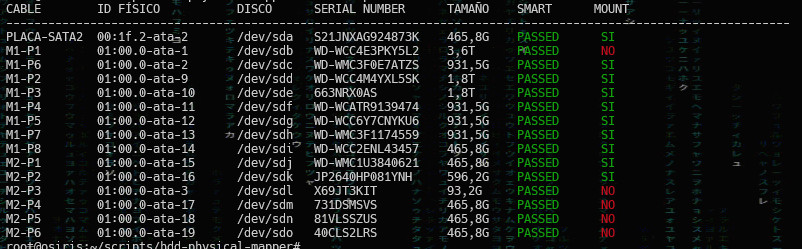
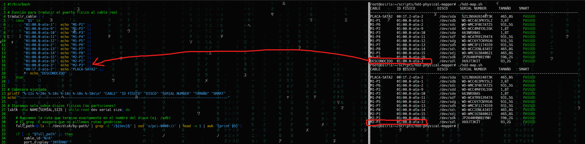

><center>⚠️ <i><small>Disclaimer<br>Este script es mi bitácora personal de combate contra el caos de cables en el servidor Osiris. Si el código te sirve, genial; si hace que tu servidor cobre vida propia y pida pizza, recuerda que yo solo estaba intentando no sacar el disco equivocado en caso de fallo.😅</small></i></center>

### 📟 Hardware Utilizado
🛒 https://amzn.to/4tmSJwh

### ℹ️ Intro

La controladora PCIe SATA viene con unos LEDs que pueden identificar el disco, sin embargo, esto no me sirve de mucho, los LEDs están cerca del conector dificultando su visión y no puedes estar metiendo la cabeza dentro de la caja para ver cuál parpadea.

He preparado un pequeño script en Bash en el que identifico los puertos físicos de la tarjeta PCI y los mapeo con los cables conectados a los HDDs.

### 📋 Problema
En sistemas con muchos discos y controladoras PCIe SATA, los nombres de los dispositivos (`/dev/sdb`, `/dev/sdc`...) son dinámicos y pueden cambiar tras un reinicio o fallo.

Cuando un disco falla, identificar **físicamente** cuál de los cables SATA debes desconectar es tarea casi imposible.

### 💡 Posible Solución
Este script cruza la siguiente información:
1. **Mapeo de Cables:** Una traducción lógica que asigna cada puerto a una etiqueta física personalizada (ej: M1-P6). En mi caso, la controladora PCIe SATA tiene 16 puertos y tengo dos manojos de 8 cables
2. **Ruta Física (PCI/SATA Bus):** El ID del puerto que nunca cambia.
3. **Nombre dev** Nombre del dispositivo dinámico asignado por el sistema al HDD
4. **Serial Number:** El identificador único impreso en la pegatina del disco.
5. **Tamaño** Capacidad del HDD
6. **Estado SMART instantáneo:** Muestra si el disco está "PASSED" u "OK" en tiempo real.
7. **Mount** Indicador de si está montado o no.

### 🛠️ Instalación y Uso

1. **Requisitos:**
   Asegúrate de tener instalada la utilidad para leer el estado de salud de los discos:
   ```bash
   sudo apt update && sudo apt install smartmontools -y
2. **Clonar y configurar:**
    ```bash
    git clone https://github.com/iMonje/hdd-physical-mapper.git
    cd hdd-physical-mapper
    chmod +x hdd-map.sh
    Personalización: Edita la función **traducir_cable** dentro del script para que coincida con tu esquema de etiquetado físico.
3. **Ejecución:**
    ```bash
    sudo ./hdd-map.sh
    ```
    

4. **Añadir nuevos discos:**

- Conecta el disco y ejecuta:

    ```bash
    sudo ./hdd-map.sh
    ```

- En la salida, la columna **CABLE** mostrará `DESCONOCIDO` y la columna **ID FÍSICO** indicará el identificador del puerto al que está conectado (ej. `01:00.0-ata-3`).

- Abre `hdd-map.sh` y añade el mapeo en la función `traducir_cable()` usando el identificador físico como clave. Ejemplo:

    ```bash
    # dentro de traducir_cable()
    case "$1" in
        ...
        "01:00.0-ata-3")  echo "M2-P3" ;;
        ...
    esac
    ```

- Guarda el archivo y vuelve a ejecutar `sudo ./hdd-map.sh`. La columna **CABLE** debería mostrar ahora la etiqueta (por ejemplo `M2-P3`).

